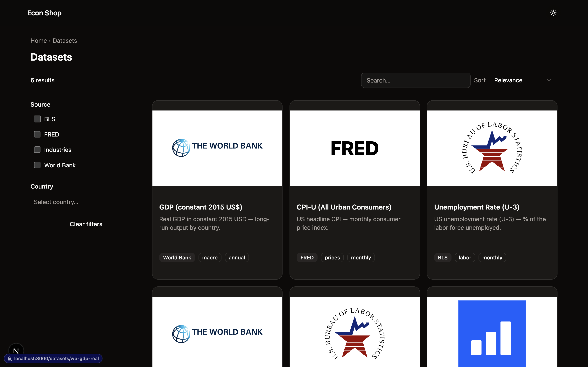
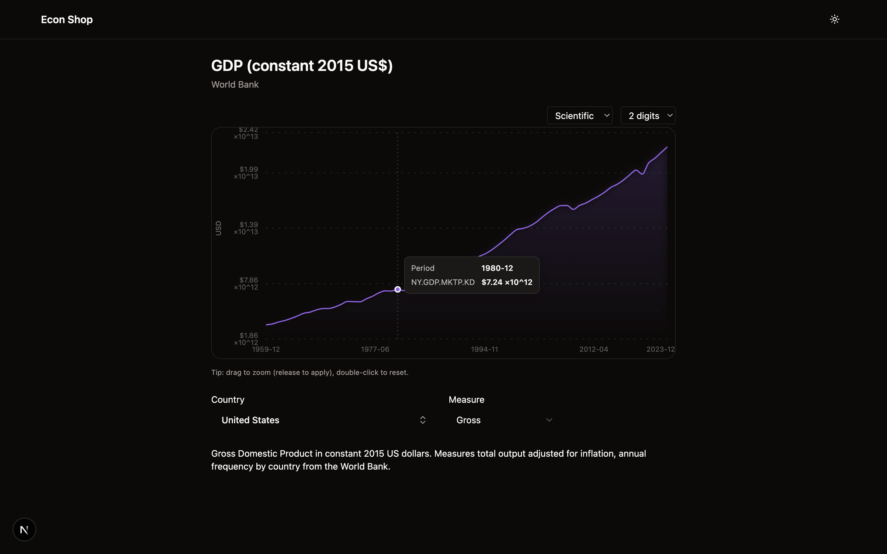
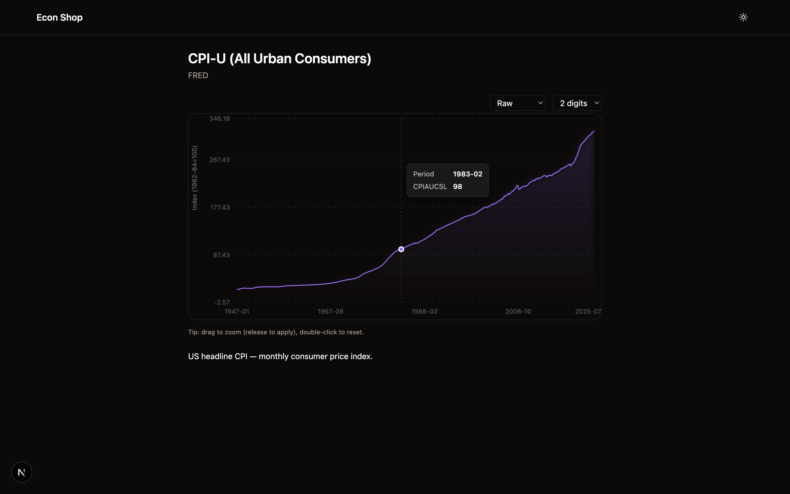
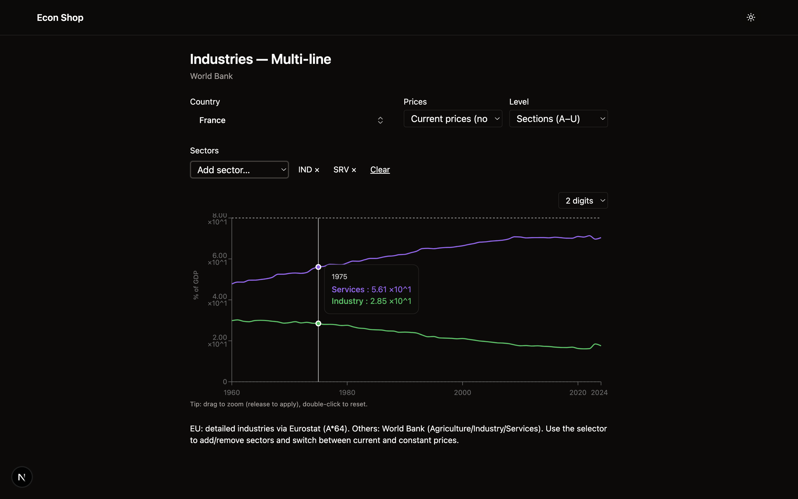
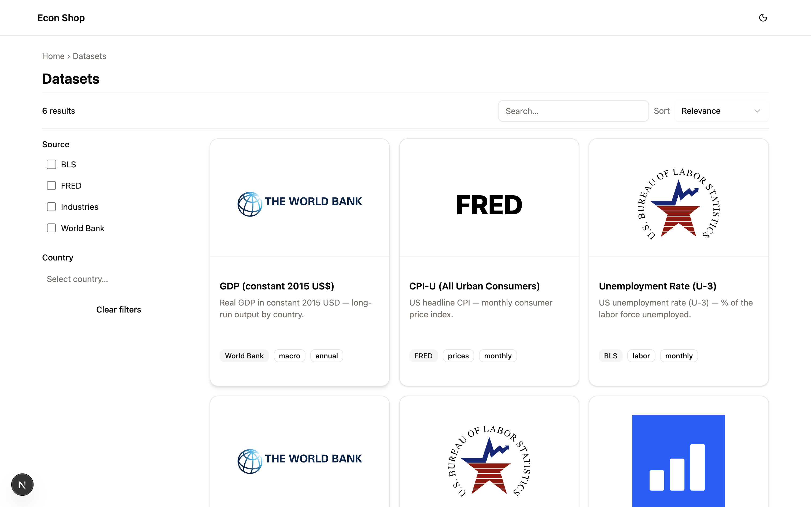
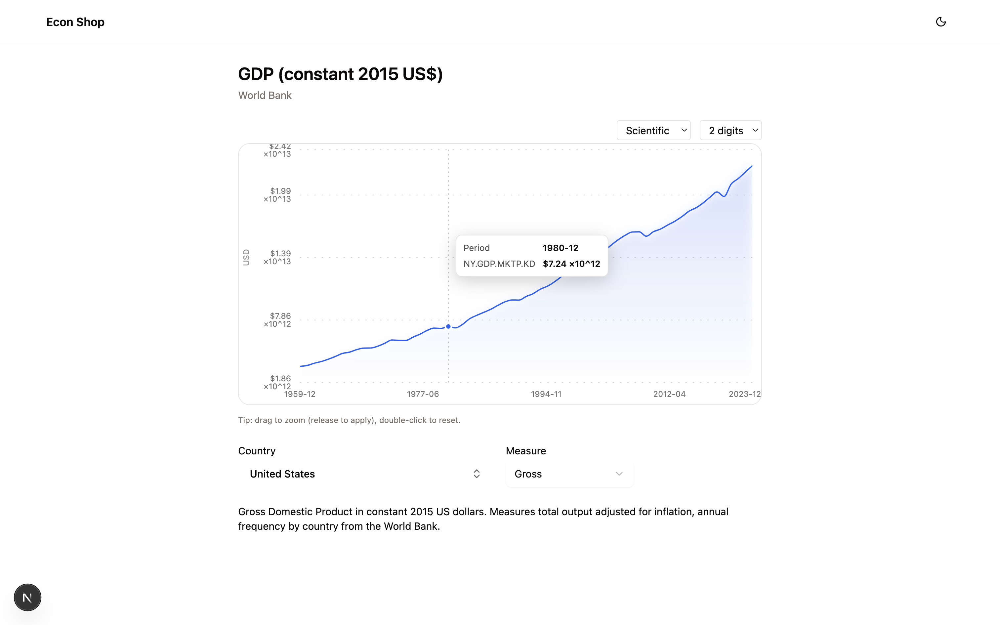
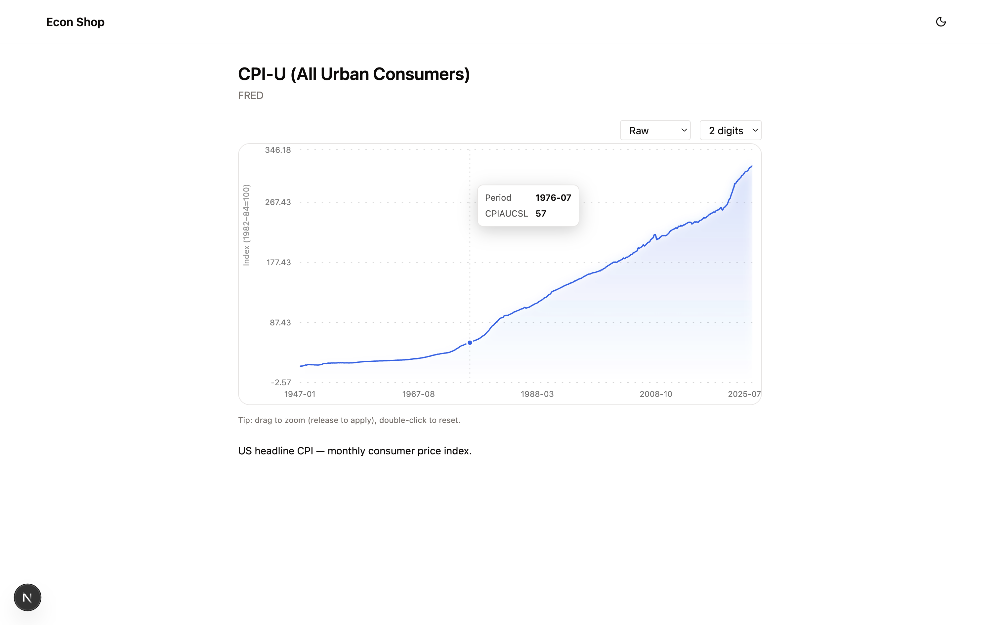
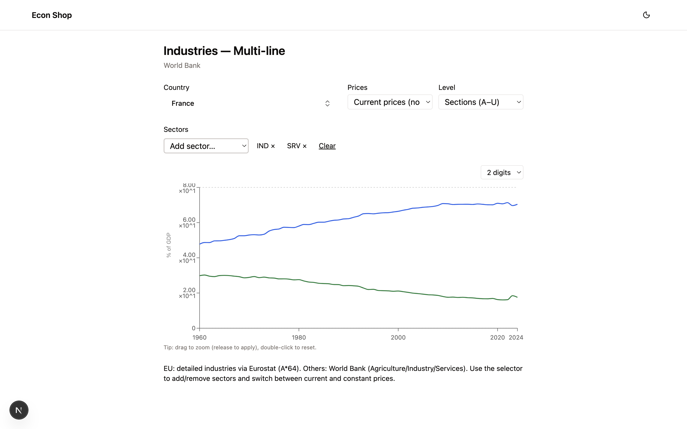

# Econ Dashboard

A “shopping-style” interface for exploring economic data.
Datasets are displayed like products with preview cards, filters, and detail
pages. Clicking a card opens a product page with a chart, clear axis
descriptions, and source attribution. Options (like sizes in a store) map to
things like country, units, and variants.

**Live site:** https://YOUR-SITE-URL.vercel.app  <!-- replace with your Vercel URL after deploy -->

---

> [!WARNING]
> **AI-assisted prototype**
>
> I acted as the senior product manager / technical lead on this project:
> I defined the vision, designed the features and information architecture,
> and set the code-organization principles. I did **not** review or verify
> every line of AI-generated code. Expect rough edges, incomplete typing,
> and inconsistencies. I aimed to drag this prototype across the
> finish line quickly, so production builds may prioritize shipping over
> strict checks. See **Build Policy** below.


---

## Features

* **Product catalog** with cards, tags, and quick filtering
* **Product pages** with charts, axis explanations, methodology notes, and
  source links
* **Theme-aware chart style**
  * **Light mode:** crisp line with a subtle solid fill (paper-style)
  * **Dark mode:** clean line with a soft, downward fade “glow”
* **Multi-line “Industries” view:** select multiple sectors and compare % of
  GDP over time
* **Units system per product:** currency prefixes ($, K/M/B/T, scientific),
  percents (%), indexes
* **Country picker** powered by source-aware country lists
* **URL-synced state** and fast client caching (TanStack Query)

---

## Project Goals

* Present datasets as **product cards** with title, source tag, and a small
  preview (sparkline).
* Provide **product pages** with charts, axis explanations, methodology notes,
  and licensing.
* Support **options/variants** (e.g., Country, Units, Measure).
* Build **modular fetchers** per provider that normalize to a common
  time-series shape.
* Enable **fast prototyping**: wire a fetcher → card → detail page quickly.
* Keep the stack **simple now**, with room to add a typed or
  high-performance backend later.

---

## Core Datasets (Implemented)

* **World Bank — GDP (constant 2015 US$)**
  Real GDP by country, annual.
* **FRED — CPI-U (All Urban Consumers)**
  U.S. consumer price index, monthly.
* **BLS — Unemployment Rate (U-3)**
  Headline unemployment percentage, monthly.
* **Industries (multi-line)**
  Sectoral breakdowns (% of GDP) with multi-select.

## Additional Planned Datasets

* **Eurostat — HICP** (EU harmonised consumer prices, monthly)
* **GFCF (Gross Fixed Capital Formation)**
* **Inequality distributions** (LLCD transforms on income/firm size)
* **Interest rates & investment breakdowns**
* **UN Comtrade (trade flows), ILOSTAT (labor), UNESCO (education), UNDESA
  (population), OWID (curated)**

---

## Technologies In Use (Right Now)

**Frontend**
* **Next.js** (React + TypeScript, **App Router**)
* **Tailwind CSS**, **shadcn/ui**, **lucide-react**
* **Recharts** for charts
* **TanStack Query** for fetching/caching

**Backend (Phase 1)**
* **Next.js Route Handlers** (`/api/*`) as a simple proxy/normalization layer

**Data Fetchers** (`src/lib/fetchers/`)
* Implemented: `worldbank.ts`, `fred.ts`, `bls.ts`
* Planned: `eurostat.ts`, `comtrade.ts`, `ilostat.ts`, `owid.ts`, `undesa.ts`,
  `unesco.ts`

**Data Shape (normalized)**
* Common **Series** shape used by charts; providers are normalized to a
  consistent time-series format so the UI stays agnostic.

---

## Screenshots

### Dark theme







### Light theme







---

## Build Policy

This repo is an AI-assisted prototype. Production builds may **skip ESLint and
TypeScript checks** to avoid blocking deploys while iterating quickly.

If you choose to enable this behavior, set in `next.config.ts`:

```ts
import type { NextConfig } from "next";

const nextConfig: NextConfig = {
  eslint: { ignoreDuringBuilds: true },
  typescript: { ignoreBuildErrors: true }
};

export default nextConfig;
```

